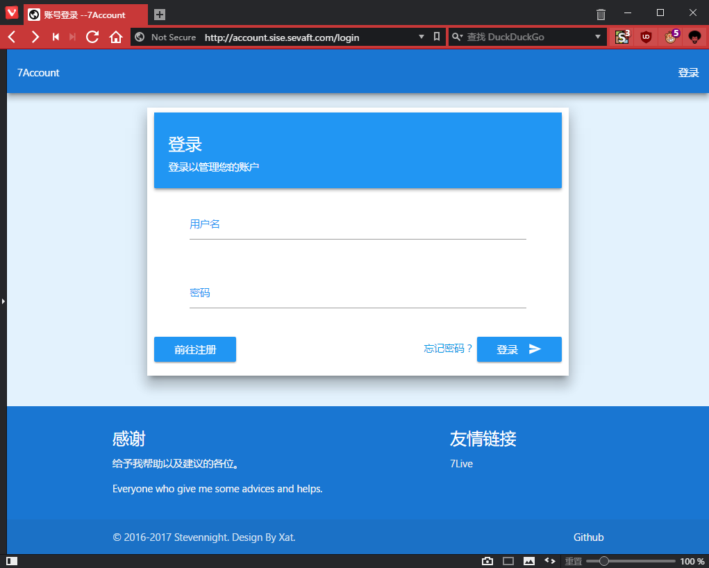
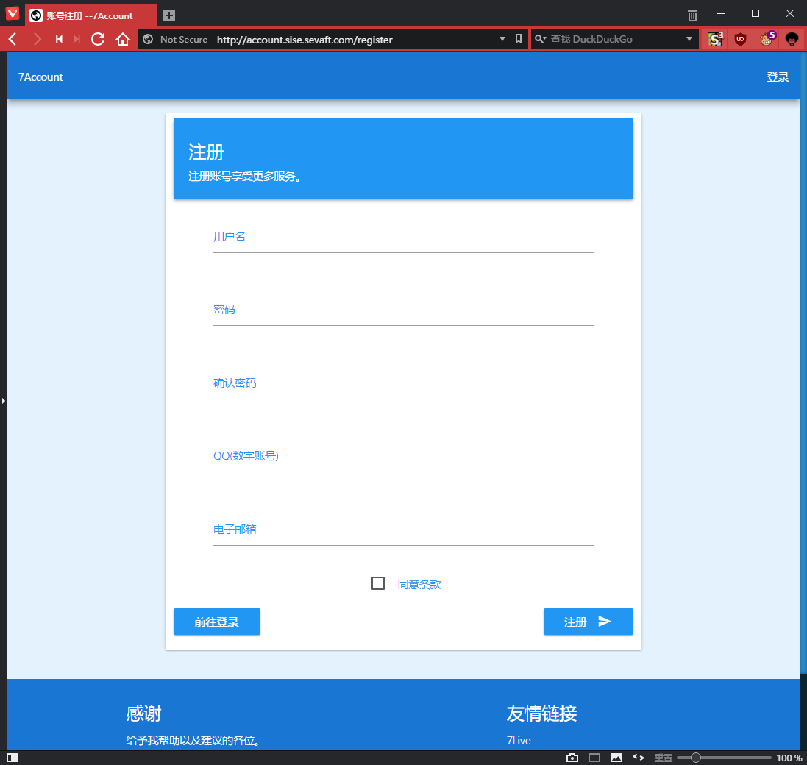
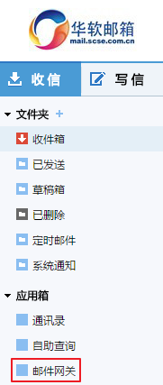
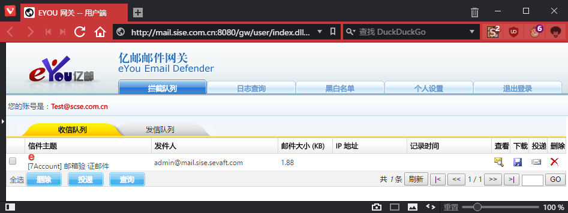
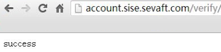
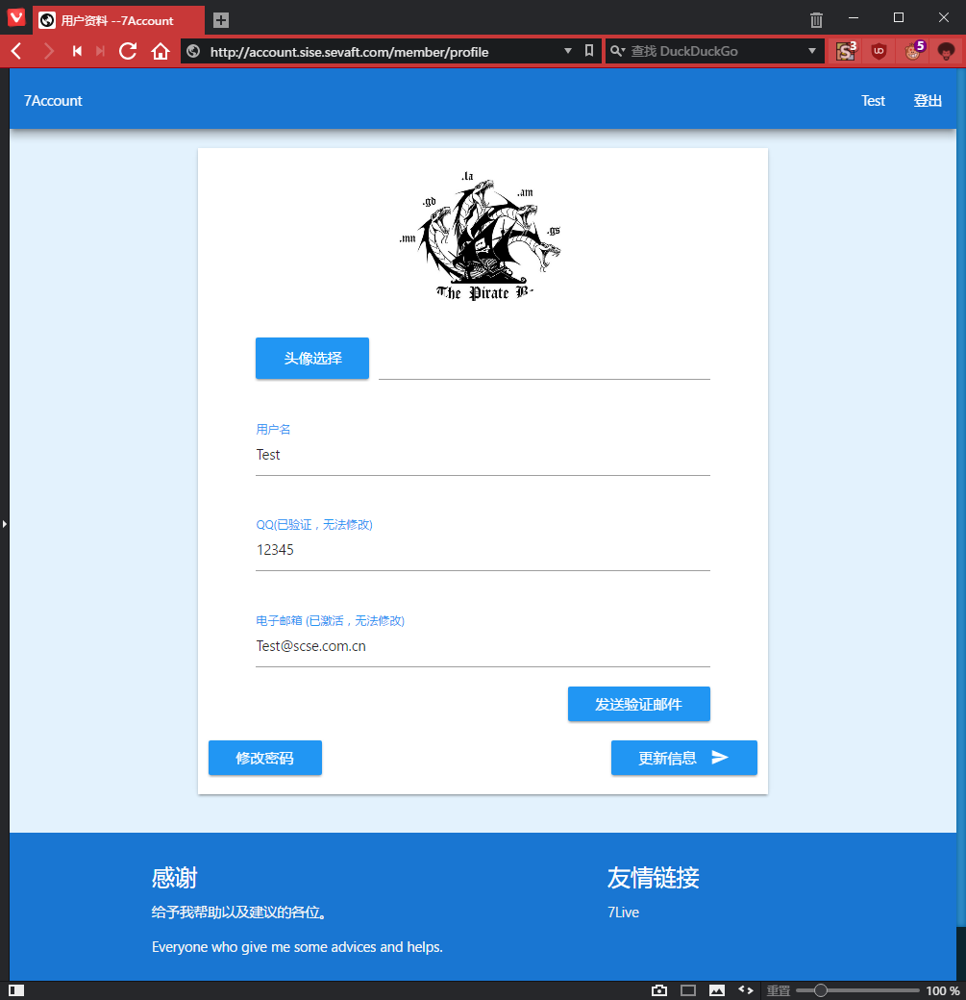
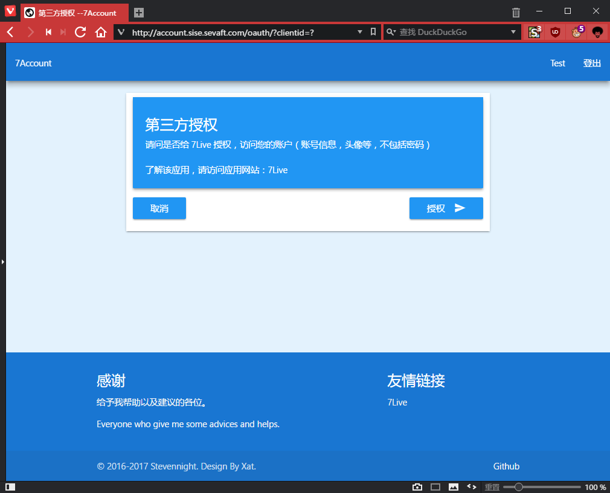

# 注册流程

## 前言

直播系统：http://live.sise.sevaft.com

账号系统：http://account.sise.sevaft.com/login

直播系统和账号系统是分离的，可以在域名的前缀看出区别，这设计上的缺陷导致了对用户的不友好，尽管设计的意图可能是建立一个账号系统，然后直播系统登录获取账号信息经由这（第三方）账号系统授权。

浏览器支持：请使用高版本的 Chrome 和 Firefox 还有 Edge 。

双核浏览器请使用急速模式，兼容模式的本质是调用低版本的 IE(Internet Explorer) 浏览器。 

## 快速注册

前往注册

用户名不支持中文

邮箱只支持 **@scse.com.cn**

点击注册后你会收到一封验证邮件，但被邮件网关拦截了。

复制邮件中的链接，然后粘贴至浏览器地址栏，回车。

成功

这个页面 （ http://account.sise.sevaft.com/member/profile ）的入口目前只存在账号系统的用户名处。

有可能会没收到邮件，可以尝试再发送一次。重复发送的间隔时间是十五分钟。

这页面也是以后修改密码、用户名和头像的地方。

头像选择后，更新信息显示 413 Request Entity Too Large ？图片太大。

作为个人服务无法保证所有的服务都在正常运行，若尝试无果，请加 QQ 群联系管理员：544510551

回到直播系统（ http://live.sise.sevaft.com ）登录授权。

-

CC BY-NC-SA 3.0 署名归属 https://github.com/stevennight/Stevennight_Live 项目

PDF 文件经由 Typora 导出。