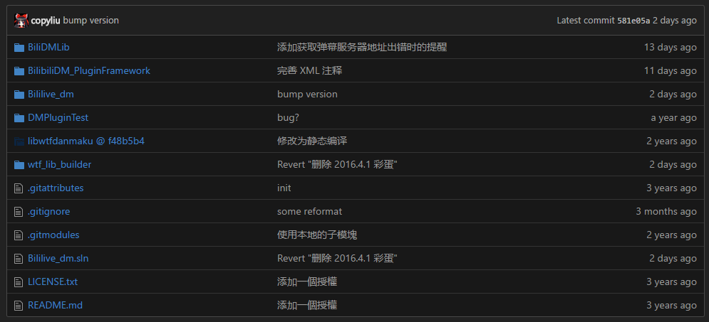
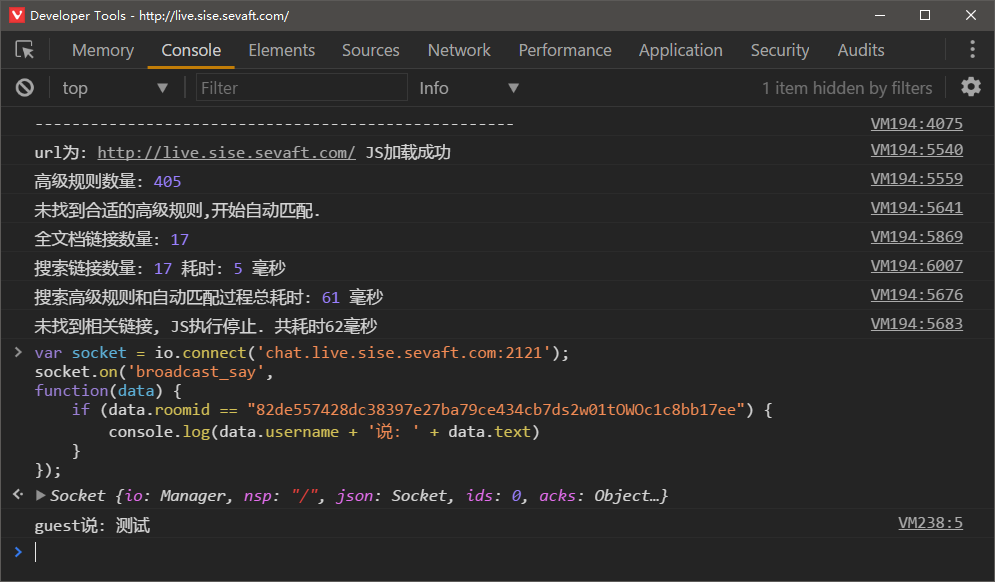
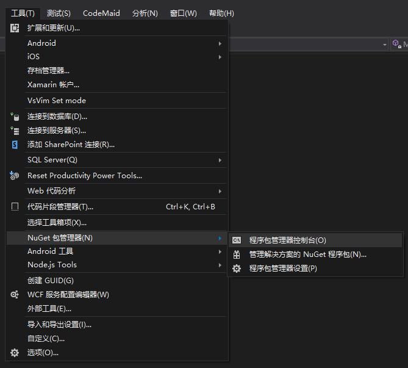
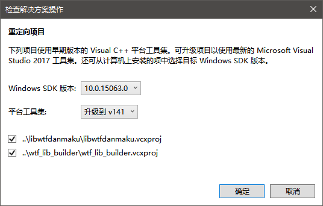

# 直播弹幕工具

[TOC]

## 前言

官网：https://www.danmuji.cn/

项目：https://github.com/copyliu/bililive_dm/ 

你可以在其官网看到界面和提供的功能。由于 bililive_dm 项目使用 WTFPL 协议，就是  DO WHAT THE FUCK YOU WANT TO PUBLIC LICENSE，所以我没有开源的义务。但是一份开放的文档并不输给开放的代码就是了。

需要安装 Git 命令行工具： https://git-scm.com/ 

Visual Studio  C# 以及 C++ 开发环境：https://www.visualstudio.com/vs/community/

## 克隆项目



> https://github.com/xqq/libwtfdanmaku 提供了高性能的弹幕引擎，bililive_dm 调用其生成的 DLL 文件。

由于存在 libwtfdanmaku 子项目，需要加入`--recursive` 选项，否则会克隆空目录。

参阅：https://git-scm.com/book/en/v2/Git-Tools-Submodules

```shell
git clone --recursive https://github.com/copyliu/bililive_dm.git
```

Windows 可以`Shfit`+`鼠标右键`在想要的文件夹里打开 CMD 窗口或 Powershell 窗口然后执行上面的 Git 命令。

## 网页源码

```javascript
var socket = io.connect('chat.live.sise.sevaft.com:2121');
socket.on('broadcast_say',
function(data) {
    if (data.roomid == "82de557428dc38397e27ba79ce434cb7ds2w01tOWOc1c8bb17ee") {
        console.log(data.username + '说: ' + data.text)
    }
});
```

可以轻易的在页面的源码中找到以上类似的片段：view-source:http//live.sise.sevaft.com/room/1

这里只做稍微修改使它能在浏览器的控制台（ Console ）运行。

不过不要在发送消息的页面运行这个程序，会收不到服务器消息的。



>在开发者工具的设置中将主题设置成了暗色。⋮ → Settings → Theme → Dark。

## C# 控制台应用

新建项目 C# 控制台应用(.NET Framework)，先写个控制台应用测试接收。

引入了 https://github.com/Quobject/SocketIoClientDotNet 库使写法更接近网页使用 https://github.com/socketio/socket.io-client 写的代码。



> Visual Studio 内建了包管理器，参阅：https://docs.microsoft.com/zh-cn/nuget/tools/package-manager-console

使用 Nuget 安装:

```
Install-Package SocketIoClientDotNet
```

写 C# 代码：

```c#
using Newtonsoft.Json.Linq;
using Quobject.SocketIoClientDotNet.Client;
using System;
using System.Threading;

namespace Recive
{
    internal class Program
    {
        private static void Main(string[] args)
        {
            var socket = IO.Socket("ws://chat.live.sise.sevaft.com:2121");
            ManualResetEvent mre = new ManualResetEvent(false);
            socket.On("broadcast_say", (data) =>
            {
                JObject jo = JObject.Parse(data.ToString());
                if (jo["roomid"].ToString() == "82de557428dc38397e27ba79ce434cb7ds2w01tOWOc1c8bb17ee")
                {
                    Console.WriteLine(data.GetType());
                    Console.WriteLine(data.ToString());
                    Console.WriteLine();
                    Console.WriteLine(jo["username"]);
                    Console.WriteLine(jo["text"]);
                    Console.WriteLine(jo["roomid"]);
                    Console.WriteLine();
                }
            });
            mre.WaitOne();
        }
    }
}
```

## 尴尬

双击打开 Bililive_dm.sln，sln 是 solution 的缩写也就是解决方案的意思。



这里我遇到了比较尴尬的情况，由于 libwtfdanmaku 是用 C++ 开发的，如图我用的是 Visual Studio 2017 Community ，然后 2017 装了 C# 没装 C++...不过我倒是装了 2013 的 C++...所以取消了重定向。

不知道是不是因为这个尴尬的原因 bililive_dm\wtf_lib_builder\ 目录下的 Build_Debug.bat 和 Build_Release.bat 都没按想象的那样工作...只能手动去修改这两个文件。

Build_Debug.bat：

```shell
"C:\Program Files (x86)\MSBuild\12.0\Bin\MSBuild.exe" /nologo /verbosity:m /maxcpucount /p:Configuration="Debug",Platform="Win32" "../libwtfdanmaku/libwtfdanmaku.vcxproj"
"C:\Program Files (x86)\MSBuild\12.0\Bin\MSBuild.exe" /nologo /verbosity:m /maxcpucount /p:Configuration="Debug",Platform="x64" "../libwtfdanmaku/libwtfdanmaku.vcxproj"
```

Build_Release.bat：

```shell
"C:\Program Files (x86)\MSBuild\12.0\Bin\MSBuild.exe" /nologo /verbosity:m /maxcpucount /p:Configuration="Release",Platform="Win32" "../libwtfdanmaku/libwtfdanmaku.vcxproj"
"C:\Program Files (x86)\MSBuild\12.0\Bin\MSBuild.exe" /nologo /verbosity:m /maxcpucount /p:Configuration="Release",Platform="x64" "../libwtfdanmaku/libwtfdanmaku.vcxproj"
```

修改后在 Powershell 或 CMD 中运行它们。

然后到 bililive_dm\libwtfdanmaku\Release 文件夹里对应 Win32 和 x64 文件夹下的 .dll 文件复制到 bililive_dm\Bililive_dm 文件夹下对应的 Win32 和 x64 文件夹。

MSBuild 的目录没有写到系统环境变量里，所以找不到这个命令，通常目录就是 C:\Program Files (x86)\MSBuild\ 像 12.0 对应的就是 Visual Studio 2013 ，而原项目就是在 Visual Studio 2013 中开发的.

## libwtfdanmaku 项目

回到 Visual Studio ，`Ctrl`+`F5` 快捷键开始执行不调试。

双击资源管理器（视图 → 解决方案资源管理器）中 MainWindow.xaml 文件会加载设计器，你可以在工具箱（视图 → 工具箱）中拖动控件。

拖动了些控件，生成了代码：

```xml
<StackPanel Height="25" VerticalAlignment="Top" DockPanel.Dock="Top" Orientation="Horizontal">
            <TextBlock TextWrapping="Wrap" Text="7Live 房间密钥：" HorizontalAlignment="Left" VerticalAlignment="Center" />
            <TextBox x:Name="RoomKey" TextWrapping="Wrap" Width="80" HorizontalAlignment="Left" VerticalAlignment="Center" />
            <Button x:Name="ConnectBtn" Content="连接" Width="70" HorizontalAlignment="Left" VerticalAlignment="Center" Margin="28,0,0,0" Click="ConnectBtn_Click" />
</StackPanel>
```

右键生成的按钮控件查看代码，然后双击按钮生成点击事件的代码。

在代码块里写代码。

调用项目内的函数：

```c#
public void logging(string text)//写入日志
public void AddDMText(string user, string text, bool warn = false, bool foreceenablefullscreen = false)//弹幕弹窗
```

在 Bililive_dm → Properties → Settings.settings 文件中设置名称为 roomKey 类型为 string 以存储信息

调用 Save() 函数存储信息，大概存到了哪个文件里，不怎么关心：

```c#
   private void SaveRoomKey(string roomKey)
        {
            try
            {
                Properties.Settings.Default.roomKey = RoomKey.Text;
                Properties.Settings.Default.Save();
            }
            catch (Exception)
            {
                // ignored
            }
            //Do whatever you want here..
        }
```

程序初始化的时候获取文件里的信息：

```c#
 this.RoomKey.Text = Properties.Settings.Default.roomKey.ToString();
```
-

CC BY-NC-SA 3.0 署名归属 https://github.com/stevennight/Stevennight_Live 项目

PDF 文件经由 Typora 导出。