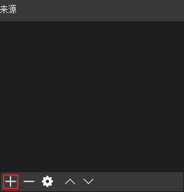
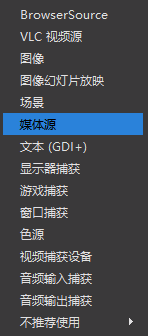
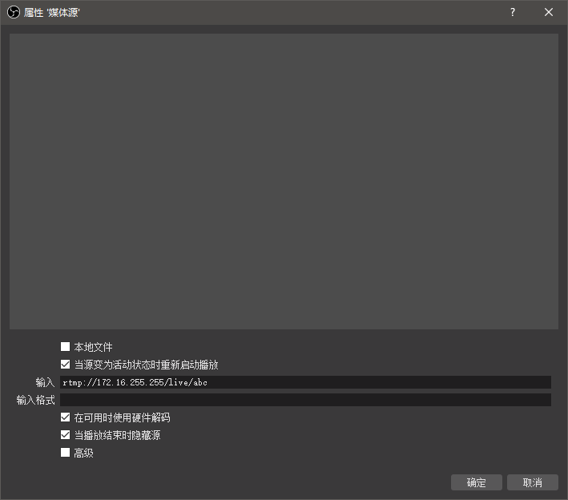
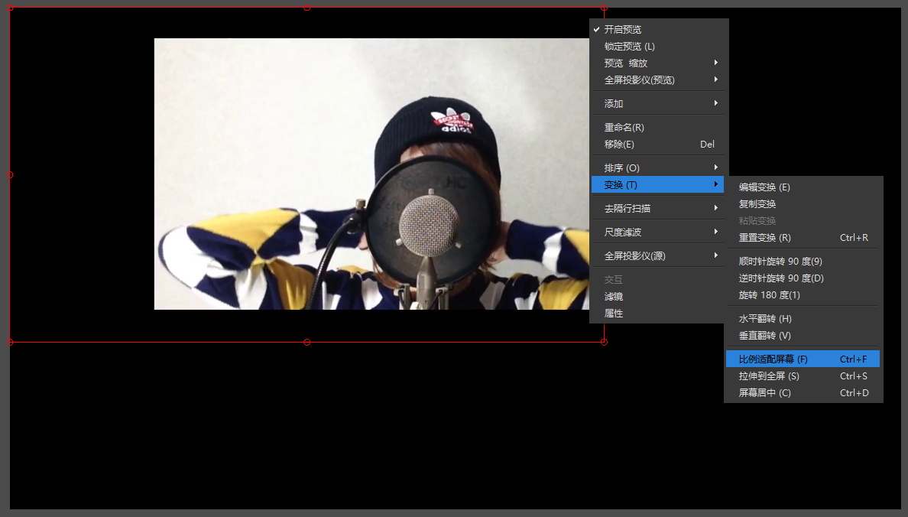
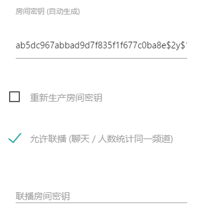

# 组织百人级的直播

[TOC]

## 前言

假设能找到 12 台高性能的机器（为什么是 12 台？因为如果需要组织一场守望先锋的线下赛需要 12 台机器。）

这使得能忽略机器性能上的限制而只专注讨论网络。

-

数据的最小单位是 bit ，音译为比特，而 8 比特（ bit ）组成 1 Byte 也就是 1 字节。

8 比特 = 1 字节，8 bit = 1 Byte ，8 b = 1 B。都是一个意思。（注意字母 B 在大小写上的区别）

数据传输更常用比特（ bit ）作为单位，数据存储则为字节（ Byte ）。

所谓的比特率（ bitrate ）的单位是 Kbps(Kibi bit per second) 也是就是 Kb/s ，表示每秒数据量的大小。

Kibi(2^10) 是有人提议用来解决 Kilo 含义不准确的自创词。

-

已知网络带宽的上限是 100 Mbps。（1M=1024K）

如果传输音频的比特率为 320 Kbps ，传输视频的比特率为 4800 Kbps ，合计为 5120 Kbps 。

20 个连接便能占满带宽，一旦带宽开始占满，多出于带宽的数据便会丢失。

你可以在任务管理器的性能中实时看到网络每秒数据量的大小。

如果我们使用一台机器在观众位作为直播源，而其他十一台机器进行分流，那就能组织起百人级高质量的直播。

为了保证十一台机器能得到数据，直播源应当被隐藏不显示从而不为他人所知。

## 分流

添加来源为媒体源

取消本地文件勾选，输入填进需要转播的直播源。

> 图片截自：Lefty Hand Cream - なんでやねんねん 

可以在预览处右键适配一下。然后开始串流即可。

## 使用联播连接至同一聊天室

直播源勾选上允许联播，将房间密钥告知分流房间，分流房间在联播房间密钥填上直播源的房间密钥即可。

## 其它

使用 SRS 作为服务器的可以参阅文档使用转发（ Forward ）：

https://github.com/ossrs/srs/wiki/v1_CN_Forward

https://github.com/ossrs/srs/wiki/v3_CN_Forward

RTMP 流转发（ Forward ）部署实例：

https://github.com/ossrs/srs/wiki/v1_CN_SampleForward

https://github.com/ossrs/srs/wiki/v3_CN_SampleForward

注意参阅对应版本的文档。

-

CC BY-NC-SA 3.0 署名归属 https://github.com/stevennight/Stevennight_Live 项目

PDF 文件经由 Typora 导出。